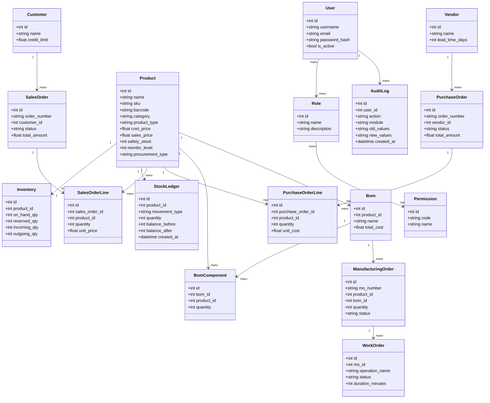
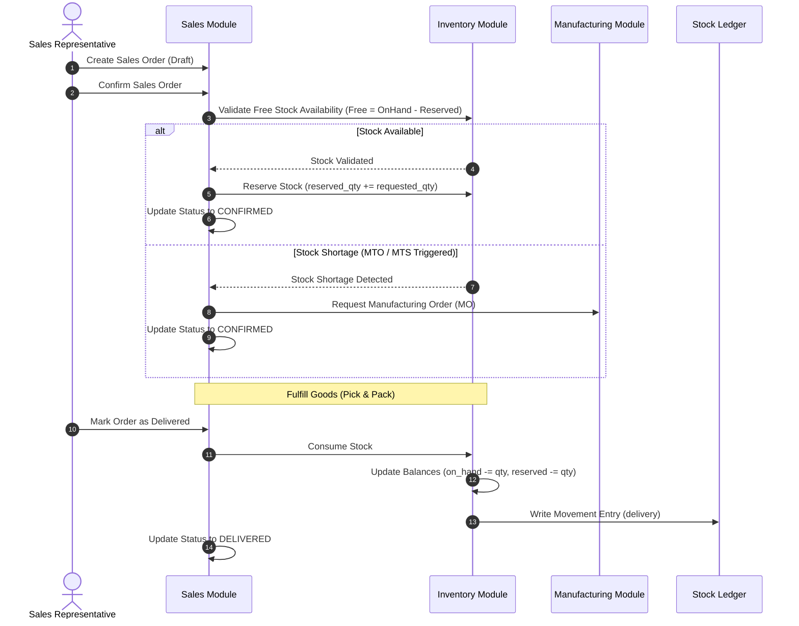
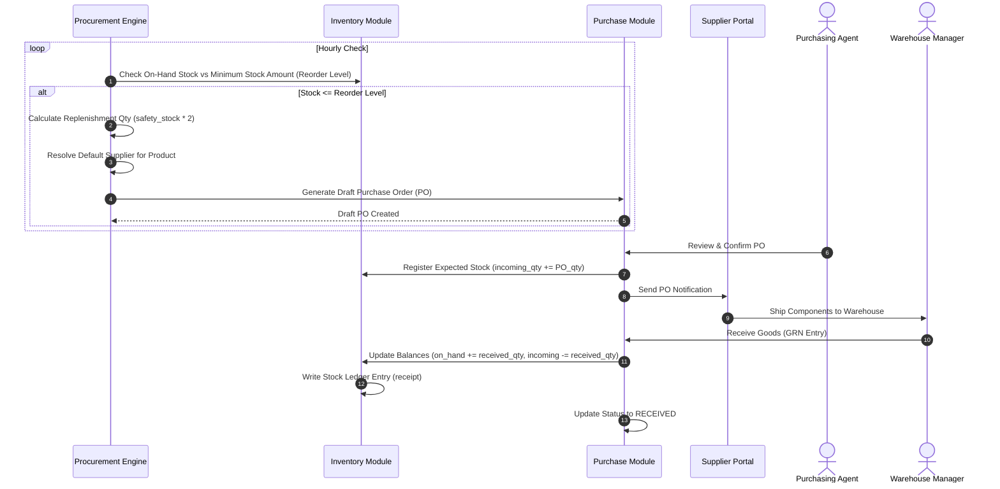
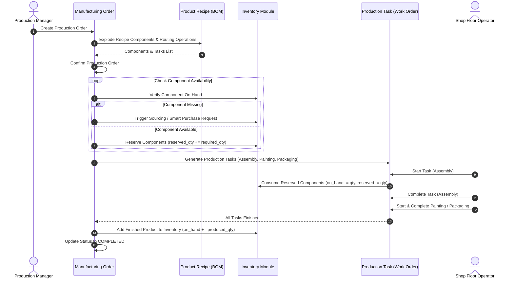

# NexusERP Architecture Specification

This document details the software architecture, database schemas, core domain logic, and cross-module workflows of the **NexusERP** system.

---

## 1. System Architecture

NexusERP is designed around a **Layered Architecture** pattern, enforcing separation of concerns between presentation, web requests, business domain services, and database persistence.

```
┌────────────────────────────────────────────────────────────────────────┐
│                        Presentation Layer (UI)                         │
│       - HTML5 Semantic Markup & Custom Styling                         │
│       - Bootstrap 5.3 & Bootstrap Icons CSS Framework                  │
│       - Dynamic Client Rendering (Jinja Templates, Vanilla JS)        │
└───────────────────────────────────┬────────────────────────────────────┘
                                    │ HTTP Requests / REST
┌───────────────────────────────────▼────────────────────────────────────┐
│                          API Router (Routes)                           │
│       - Flask Blueprints organizing HTTP route handlers                │
│       - Permission Decorators enforcing access control                 │
│       - WTForms Validation layer for clean request parameters          │
└───────────────────────────────────┬────────────────────────────────────┘
                                    │ Method Invocations
┌───────────────────────────────────▼────────────────────────────────────┐
│                     Business Logic Layer (Services)                    │
│       - Modular Service classes holding domain-specific workflows      │
│       - State Management machines (Reservation, Procurement engines)    │
│       - AI Integration controllers interfacing with external APIs      │
└───────────────────────────────────┬────────────────────────────────────┘
                                    │ ORM Sessions
┌───────────────────────────────────▼────────────────────────────────────┐
│                    Data Access Layer (Models)                          │
│       - SQLAlchemy Domain Models mappings database tables              │
│       - Relationship mappings with cascading deletions                 │
│       - Standardized Audit Hook capturing state changes                │
└───────────────────────────────────┬────────────────────────────────────┘
                                    │ SQLite Protocol
┌───────────────────────────────────▼────────────────────────────────────┐
│                        Database Layer (Storage)                        │
│       - SQLite persistent storage engine                               │
│       - Database Migrations managed via Alembic (Flask-Migrate)        │
└────────────────────────────────────────────────────────────────────────┘
```

---

## 2. Component Folder Structure

```text
app/
├── extensions/     # Third-party integrations (SQLAlchemy, LoginManager, Bcrypt, SocketIO)
├── models/         # Database entities (User, Product, SalesOrder, Bom, AuditLog, etc.)
├── routes/         # Flask blueprints mapping endpoints to view logic
├── services/       # Domain controllers implementing business workflows:
│   ├── auth/          # Authentication and authorization rules
│   ├── inventory/     # Inventory accounting, adjustments, and ledgering
│   ├── sales/         # Sales order workflows, order lines, and fulfillment
│   ├── purchase/      # Purchase order generation, supplier matching, and receiving
│   ├── manufacturing/ # Recipes (BOM), production ordering, work-center assignments
│   ├── procurement/   # Auto-replenishment engines (MTS & MTO rules)
│   ├── pos/           # Point of sale session management and terminal checkout
│   ├── analytics/     # Metrics calculation, KPI aggregations, and business health scoring
│   ├── audit/         # Operational action capturing and database change tracking
│   └── ai/            # Gemini-powered conversational business assistant
├── static/         # Public assets (custom stylesheets, browser scripts, images)
├── templates/      # Jinja templates split by domain blueprint
├── utils/          # Decorators, constants, custom validators, and barcode engines
└── seed/           # Seed scripts to populate initial user configurations and demo data
```

---

## 3. Database Schema & Core Entities



---

## 4. Key Business Workflows

### 4.1 Sales Demand-to-Delivery
Manages customer orders from creation through credit verification, inventory allocation, and fulfillment.



### 4.2 Automated Procurement (Smart Purchasing)
Monitors component stock and triggers replenishment rules (Make-to-Stock reorder targets).



### 4.3 Manufacturing Execution
Explodes product recipes, tracks component consumption, and registers manufactured products.



---

## 5. Security & Permission Matrix

Access controls are managed via Role-Based Access Control (RBAC). Blueprint endpoints are secured using `@permission_required("code")` checks.

| Role | Domain Modules Access | Allowed Permissions |
| :--- | :--- | :--- |
| **System Admin** | User settings, Database parameters, Log view | `view_users`, `manage_roles`, `view_audit_logs`, `db_reset` |
| **Business Owner**| Dashboard analytics, Financial summaries, Copilot | `view_dashboard`, `view_reports`, `view_analytics`, `use_copilot` |
| **Sales Rep** | Customers catalog, Sales orders, Terminal checkout | `view_customers`, `manage_customers`, `manage_sales`, `confirm_sales` |
| **Inventory Mgr** | Products list, Stock adjustments, Transfers | `view_products`, `manage_products`, `view_stock`, `adjust_stock` |
| **Purchasing Agent**| Suppliers registry, Purchase orders | `view_vendors`, `manage_vendors`, `manage_purchases`, `receive_purchases` |
| **Production Mgr**| BOM definitions, Production scheduling, Tasks | `view_recipes`, `manage_recipes`, `manage_production`, `complete_tasks` |
| **POS Cashier** | Retail sales terminal | `pos_checkout`, `manage_sessions` |

---

## 6. Audit Logging System

The Audit Engine captures modifications to tracking entities. Every write operation writes a record to the `AuditLog` database table.

```json
{
  "timestamp": "2026-06-14T09:40:00.123Z",
  "user_id": 4,
  "action": "UPDATE",
  "module": "Sales Order",
  "reference_number": "SO-202606-0012",
  "old_values": {
    "status": "CONFIRMED",
    "delivery_risk": "MEDIUM"
  },
  "new_values": {
    "status": "DELIVERED",
    "delivery_risk": "LOW"
  },
  "ip_address": "127.0.0.1"
}
```

---

## 7. AI Operations Copilot Integration

The AI Operations Copilot parses operational commands to deliver contextual summaries. It processes database entities in real-time to compute structured insights.

```text
User Command: "Show me all orders at risk."
        │
        ▼
[Intent Engine] parses keywords: "orders", "at risk", "delayed"
        │
        ▼
[SQL Aggregator] queries SQLite:
 - SalesOrders where status = 'CONFIRMED' and expected_delivery < NOW()
 - Inventory where free_to_use_qty < safety_stock
        │
        ▼
[Context Builder] compiles data payload
        │
        ▼
[Google Gemini API] processes prompt with schema:
 - Generates natural language summary explaining bottlenecks (e.g., missing wood planks for Table assembly).
```
